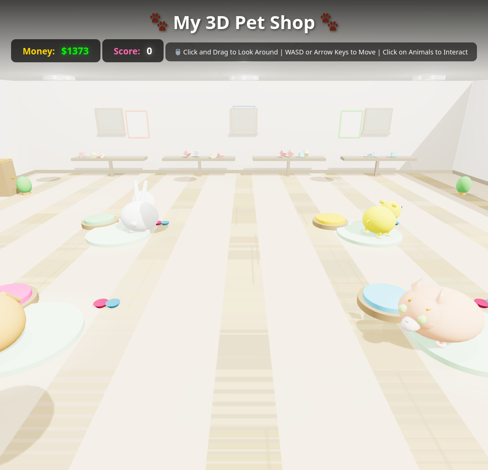

# 🐾 3D Pet Shop

A browser-based 3D pet shop simulation game where you can interact with adorable pets including dogs, cats, and rabbits. Take care of your pets by feeding, washing, petting, and playing interactive mini-games with them!



## Features

- **3D Third-Person View**: Navigate around the pet shop using WASD/Arrow keys
- **Interactive Pet Care**: Pet, feed, wash, and play with different animals
- **Mini-Games**:
  - 🐕 **Dog**: Ball throwing game
  - 🐱 **Cat**: Interactive mouse toy game
  - 🐰 **Rabbit**: Carrot catching game
- **Pet Stats System**: Monitor happiness, hunger, and cleanliness levels
- **Money & Score System**: Earn points and manage your pet shop
- **Combo System**: Build combos for higher scores

## How to Launch

### Option 1: Open Directly in Browser (Simplest)

Double-click the `index.html` file, or run:

```bash
xdg-open index.html
```

### Option 2: Using a Local Web Server (Recommended)

Some features work better with a proper web server:

**Using Python 3:**
```bash
python3 -m http.server 8000
```

**Using Python 2:**
```bash
python -m SimpleHTTPServer 8000
```

**Using Node.js:**
```bash
npx http-server
```

Then open your browser and navigate to:
```
http://localhost:8000
```

## Controls

- 🖱️ **Mouse**: Click and drag to look around
- ⌨️ **WASD** or **Arrow Keys**: Move your character
- 🖱️ **Left Click**: Click on animals to interact with them
- **Action Menu**: Choose from Pet, Feed, Wash, or Play options

## Game Stats

- **Money**: Start with $500, manage your resources
- **Score**: Earn points by taking care of pets
- **Combo**: Build combos for bonus points
- **Pet Stats**:
  - ❤️ Happiness
  - 🍖 Hunger
  - 🧼 Cleanliness

## Technologies Used

- **Three.js** (r128): 3D graphics rendering
- **HTML5 Canvas**: Mini-game rendering
- **Vanilla JavaScript**: Game logic
- **CSS3**: UI styling and animations

## Browser Compatibility

Works best in modern browsers:
- Chrome/Chromium
- Firefox
- Safari
- Edge

## License

This project is open source and available for educational purposes.
